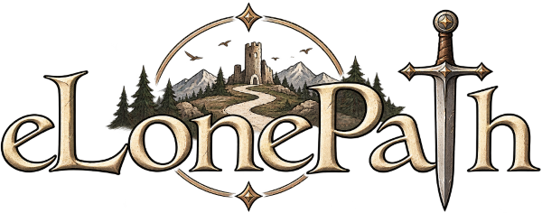

# eLone Path
[](https://github.com/mirko-pagliai/eLonePath/actions/workflows/php.yml)



Un motore per librigame digitali interattivi, ispirato ai grandi classici dei librigame solitari degli anni '80.

## Cos'è

*eLone Path* porta l'esperienza dei librigame cartacei nel digitale, senza tradirne lo spirito: ogni storia è un
insieme di pagine numerate, collegate tra loro da scelte, prove di abilità, combattimenti e finali diversi —
proprio come un libro-game di carta, solo giocabile dal browser (ed installabile come PWA).

## Filosofia

Un libro-game cartaceo non ti ha mai davvero impedito di sfogliarlo come volevi: tornare indietro dopo una
sconfitta, saltare avanti per curiosità, ignorare le regole. *eLone Path* mantiene la stessa libertà per
costruzione: ogni pagina è raggiungibile direttamente, e tornare a una pagina precedente — anche solo
modificando l'indirizzo — è sempre possibile.

## Requisiti

- PHP 8.4+
- Composer

## Avvio in locale

```
composer install
composer run-server
```

L'app sarà disponibile su `http://localhost:9996`.

## Le storie

Ogni storia vive in `resources/stories/<id>/story.json` — un file che descrive pagine, scelte, prove di dadi,
combattimenti e finali. Le storie che lo richiedono iniziano con la creazione di un personaggio (Forza, Agilità,
Percezione, Volontà), a mano o generato casualmente.

## Stato del progetto

In sviluppo attivo. Al momento è disponibile una sola storia demo, *La torre oltre il bosco*.

## Licenza

MIT
